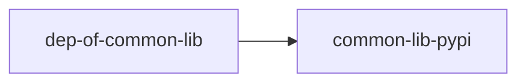

# Python Monorepo

Proof of Concept for a Python Monorepo using [`hatch`](https://hatch.pypa.io).

Hatch has a couple of significant features that are missing from Poetry and other modern packaging system for Python:
- Development dependencies override dependencies.
- Hatch has a plugin system.

## Specifications

- Some projects are published as PyPI packages.
- Some projects are published as Docker images.
- During development, all projects should use project sub-dependencies as local references (like if installed with `pip install /path/to/pkg`). If possible, editable installs would be better. 
- When building and publishing PyPI packages, all project sub-dependencies should be replaced by a simple reference (`pkg-name==version`) with the same version number as the local `pyproject.toml`.
- Projects installed as docker images should be possible to executed with a simple `CMD` like `python -m pkg_name` or simply `pkg-name`.

Currently, the parts of the monorepo that are not working ideally are (as of August 2022):
- Local project sub-dependencies cannot be installed as symlinks.
- A lot of code repetition inside the `pyproject.toml` files.
- Hatch currently does not support creating shells inside the environment.

## Project dependencies

Here is how the different sub-projects interact. 

